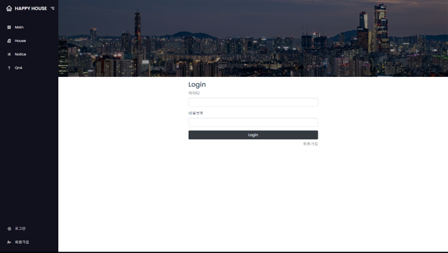

# HappyHouse_Final_구미_05반_이재완_장예은

<h2>1. 메인</h2>
뉴스 리스트가 보이고 클릭하면 해당 뉴스로 이동

  

<h2>2. 하우스</h2>
현재 내 위치가 카카오맵에 좌표에 찍히고, 검색하면 해당 매물들이 카카오맵에 찍힘 
상세 매물 정보는 테이블 형태로 출력

<h2>3. 공지사항</h2>
관리자만 등록 가능. 
조회는 로그인한 사용자만 가능

<h2>4. QnA </h2>
일반 회원도 등록 가능. 
답변은 관리자만 가능

<h2>5. 로그인</h2>
데이터베이스 사용 

<h2>6. 회원가입</h2>
유효성 검사 (아이디, 비밀번호, 이메일)

<h2>7. 마이페이지</h2>
내 정보를 확인하는 탭. 
비밀번호와 이메일 변경 가능

